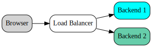
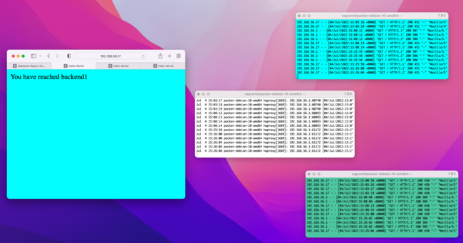

## DevOps Demo

This repo demonstrates Infrastructure as Code using Vagrant and Ansible.

<p align="center">
  
</p>

### Get this repo

Clone this repo onto your laptop and `cd` into its top level directory.

### Install tools

Get Ansible from [here](https://docs.ansible.com/ansible/latest/installation_guide/intro_installation.html)

We now use Ansible to get the other tools: VirtualBox and Vagrant
```
$ ansible-galaxy install -r requirements.yml
$ ansible-playbook --ask-become-pass playbook-bootstrap.yaml
```

### Run the demo

Open the VirtualBox UI so you can see the machines being created.

` $ vagrant up --provision`

Check everything is ok with the tests.

` $ ansible-playbook playbook-test.yaml -i inventory`

When the three machines are running, log in to each of them in a separate terminal window and tail the logs

```
$ vagrant ssh balancer
% sudo tail -f /var/log/haproxy.log
:
```
and in another iTerm2 window:
```
$ vagrant ssh backend1
% sudo tail -f /var/log/apache2/access.log
:
```
and another:
```
$ vagrant ssh backend2
% sudo tail -f /var/log/apache2/access.log
:
```
Hit the load balancer in a browser http://192.168.56.17 and see the entry in the LB log and one of the backend logs. Hit Refresh the page and see the LB entry and an entry in the other backend log.

### Coloured non-wrapping iTerm2 windows
Load iTerm2Profiles.json into iTerm2 (Profile -> Edit Profiles... -> Other Actions... -> Import JSON Profiles...)
Selecting a profile causes a tab to be opened with that colour scheme.

The logs are easier to see when they are just one line per entry. Turn off line wrapping with: `tput rmam`. Re-enable it with `tput smam`.



### Doing more work on the VMs
If you want to run the Ansible playbooks without the Vagrant provisioner then you need the machine names in the inventory file in your ssh config. Run `vagrant ssh-config` and copy the results into `~/.ssh/config`. Then you can run `ansible-playbook playbook-backend.yaml -i inventory`.

### Meta

To generate the diagram on this page use graphviz

```
$ dot -Tsvg diagram.dot > architecture.svg
```
